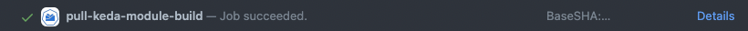

# Keda Operator

## Overview 

Keda Operator is an extension to the Kyma ecosystem that allows users to install KEDA. It follows the Kubernetes operator pattern to manage the lifecycle of the KEDA installation based on the existence and the content of the dedicated Keda custom resource (CR).


### What is KEDA?

KEDA is a flexible Event Driven Autoscaler for the Kubernetes workloads. It extends the Kubernetes autoscaling mechanisms with its own metric server and the possibility to make use of external event sources to make scaling decisions. To learn more about KEDA, see [KEDA documentation](https://keda.sh/docs/latest/concepts/).

## Install

To install keda-manager simply apply the following script:

```bash
kubectl create ns kyma-system
kubectl apply -f https://github.com/kyma-project/keda-manager/releases/latest/download/keda-manager.yaml
```

To get Keda installed, apply the sample Keda CR:

```bash
kubectl apply -f config/samples/operator_v1alpha1_keda_k3d.yaml
```

##  Development

###  Project structure

The Keda Operator module is scaffolded with `kubebuilder`. For more information on `kubebuilder`, visit the [project site](https://github.com/kubernetes-sigs/kubebuilder)).

- `config`: A directory containing the [kustomize](https://github.com/kubernetes-sigs/kustomize) YAML definitions of the module for more information, see [kubebuilder's documentation on launch configuration](https://book.kubebuilder.io/cronjob-tutorial/basic-project.html#launch-configuration)).
- `api`: Packages containing Keda CustomResourceDefinitions (CRD). 
- `controllers`: Package containing the implementation of the module's reconciliation loop responsible for managing Keda CRs.
- `Dockerfile`: The definition of the `keda-manager-module` image.
- `bin`: A directory with binaries that are used to build/run project.
- `config.yaml`: Configuration file to override module's Helm chart properties.
- `docs`: Contains context documentation for the project.
- `hack`: A directory containing scripts and makefiles that enchance capabilities of root `Makefile`.
- `pkg`: Contains packages used in the project.
- `keda.yaml`: Kubernetes objects that represent `keda module`


### Prerequisites

- Access to a Kubernetes cluster
- [Go](https://go.dev/)
- [k3d](https://k3d.io/v5.4.6/)
- [Docker](https://www.docker.com/)
- [kubectl](https://kubernetes.io/docs/tasks/tools/)
- [kubebuilder](https://book.kubebuilder.io/)

### Useful Make targets 

You can build and run the Keda Operator in the Kubernetes cluster without Kyma.
For the day-to-day development on your machine, you don't always need to have it controlled by Kyma's `lifecycle-manager`.

Run the following commands to deploy Keda Operator on a target Kubernetes cluster (i.e., on k3d):

1. Clone the project.

   ```bash
   git clone https://github.com/kyma-project/keda-manager.git && cd keda-manager/
   ```

2. Set the Keda Operator image name.

   > NOTE: You can use local k3d registry or your dockerhub account to push intermediate images.  
   ```bash
   export IMG=<DOCKER_USERNAME>/custom-keda-manager:0.0.1
   ```

3. Verify the compatibility.

   ```bash
   make test
   ```
4. Build and push the image to the registry.

   ```bash
   make module-image
   ```
5. Create a target Namespace.

   ```bash
   kubectl create ns kyma-system
   ```

6. Deploy.

   ```bash
   make deploy
   ```

7. Verify if Keda Operator is deployed

   ```bash
   kubectl get deployments -n kyma-system       
   NAME                             READY   UP-TO-DATE   AVAILABLE   AGE
   keda-operator            1/1     1            1           1m
   ```


### How to use Keda Operator to install Keda

Keda Operator installs KEDA based on the watched Keda CRs:

- Apply Keda CR (sample) to have Keda installed.

   ```bash
   kubectl apply -f config/samples/operator_v1alpha1_keda_k3d.yaml
   ```

   After a while, you will have Keda installed, and you should see its workloads:

   ```bash
   NAME                             READY   UP-TO-DATE   AVAILABLE   AGE
   keda-operator                    1/1     1            1           3m
   keda-manager                     1/1     1            1           3m
   keda-manager-metrics-apiserver   1/1     1            1           3m
   ```

   Now you can use KEDA to scale workloads on the Kubernetes cluster. Check the [demo application](docs/keda-demo-application.md).

- Remove Keda CR to have Keda uninstalled.

   ```bash
   kubectl delete -f config/samples/operator_v1alpha1_keda_k3d.yaml
   ```
   This uninstalls all Keda workloads but leaves `operator-keda-manager`.

   > **NOTE:** Keda Operator uses finalizers to uninstall the Keda module from the cluster. It means that Keda Operator blocks the uninstallation process of KEDA until there are user-created custom resources (for example ScaledObjects).

- Update the specification of Keda CR to change the Keda installation

   [This example](docs/keda-configuration.md) shows how to modify the Keda properties using the `keda.operator.kyma-project.io` CR.


   ```bash
   cat <<EOF | kubectl apply -f -
   apiVersion: operator.kyma-project.io/v1alpha1
   kind: Keda
   metadata:
   name: keda-sample
   spec:
   logging:
      operator:
         level: "debug"
   resources:
      operator:
         limits:
         cpu: "1"
         memory: "200Mi"
         requests:
         cpu: "0.5"
         memory: "150Mi"
      metricServer:
         limits:
         cpu: "1"
         memory: "1000Mi"
         requests:
         cpu: "300m"
         memory: "500Mi"
   EOF
   ```


## Installation on Kyma runtime

This section describes the setup of the Keda module on top of the Kyma installation with `lifecycle manager`.
In such a setup, you don't need to install Keda Operator, but it is installed and managed by a `lifecycle manager` instead.

### Lifecycle management of Keda Operator in Kyma

When you enable the Keda module in the Kyma CR in your Kyma runtime, the lifecycle-manager downloads the bundled package of the Keda Operator and installs it. Additionally, it applies a sample Keda CR, which triggers Keda Operator to install the Keda module.


In order to be consumable by lifecycle-manager, the Keda module (Keda + Keda Operator) is bundled in a [specific way](https://github.com/kyma-project/community/tree/main/concepts/modularization#component-packaging-and-versioning) and described using the special Module Template CR.


### Local mode in k3d

When using a local k3d cluster, you can also use the local OCI image registry that comes with it.
Thanks to that, you don't need to push the Keda module images to a remote registry and test the changes in the Kyma installation that is set up entirely on your machine.

Installation steps on local k3d environments are explained in details [here](docs/installation-on-k3d.md).
There is a dedicated `make` target (in the `hack` folder) that does all of them, so it is recommended to use it.

1. Clone the project.

   ```bash
   git clone https://github.com/kyma-project/keda-manager.git && cd keda-manager/
   ```
2. Build the operator locally and run it on the k3d cluster.

   ```bash
   make -C hack/local run
   ```
> **NOTE:** To clean up the k3d cluster, use the `make k3d stop` make target.

### Install on remote Kyma runtime

> **Prerequisite:** `lifecycle-manager` must be installed on the cluster (locally), or the cluster itself must be managed remotely by the central control-plane.

In this section, you will learn how to install a PR version of the Keda module by a `lifecycle-manager` on a remote cluster.
Such a setup requires OCI images for the Keda module version to be built and pushed into a public registry. Also, a module template matching the version must be available so that it can be applied on the remote cluster.
CI jobs that are running on PRs and on main branch will help to achieve that.

1. Create a pull request (PR) or use an existing one in the [`keda-manager`](https://github.com/kyma-project/keda-manager) repository,
on the PR page, scroll to the PROW job status list. 

2. Click the `Details` hyperlink in the `pull-keda-module-build` row (make sure the job has finished with success).



The module template will be printed in the module template section, between the tags.

> `~~~~~~~~~~~~BEGINING OF MODULE TEMPLATE~~~~~~~~~~~~~~`

```yaml
apiVersion: operator.kyma-project.io/v1alpha1
kind: ModuleTemplate
metadata:
  name: moduletemplate-keda
...
```

> `~~~~~~~~~~~~~~~END OF MODULE TEMPLATE~~~~~~~~~~~~~~~~`

<details>
<summary><b>Example of full job build result</b></summary>

```text
make: Entering directory '/home/prow/go/src/github.com/kyma-project/keda-manager/hack/ci'
make[1]: Entering directory '/home/prow/go/src/github.com/kyma-project/keda-manager'
mkdir -p /home/prow/go/src/github.com/kyma-project/keda-manager/bin
## Detect if operating system 
test -f /home/prow/go/src/github.com/kyma-project/keda-manager/bin/kyma-unstable || curl -s -Lo /home/prow/go/src/github.com/kyma-project/keda-manager/bin/kyma-unstable https://storage.googleapis.com/kyma-cli-unstable/kyma-linux
chmod 0100 /home/prow/go/src/github.com/kyma-project/keda-manager/bin/kyma-unstable
test -s /home/prow/go/src/github.com/kyma-project/keda-manager/bin/kustomize || { curl -s "https://raw.githubusercontent.com/kubernetes-sigs/kustomize/master/hack/install_kustomize.sh" | bash -s -- 4.5.6 /home/prow/go/src/github.com/kyma-project/keda-manager/bin; }
{Version:kustomize/v4.5.6 GitCommit:29ca6935bde25565795e1b4e13ca211c4aa56417 BuildDate:2022-07-29T20:42:23Z GoOs:linux GoArch:amd64}
kustomize installed to /home/prow/go/src/github.com/kyma-project/keda-manager/bin/kustomize
cd config/manager && /home/prow/go/src/github.com/kyma-project/keda-manager/bin/kustomize edit set image controller=europe-docker.pkg.dev/kyma-project/dev/keda-manager:PR-101
[0;33;1mWARNING: This command is experimental and might change in its final version. Use at your own risk.
[0m- Kustomize ready
- Module built
- Default CR validation succeeded
- Creating module archive at "./mod"
- Image created
- Pushing image to "europe-docker.pkg.dev/kyma-project/dev/unsigned"
- Generating module template
make[1]: Leaving directory '/home/prow/go/src/github.com/kyma-project/keda-manager'

~~~~~~~~~~~~BEGINING OF MODULE TEMPLATE~~~~~~~~~~~~~~
apiVersion: operator.kyma-project.io/v1alpha1
kind: ModuleTemplate
metadata:
  name: moduletemplate-keda
  namespace: kcp-system
  labels:
    "operator.kyma-project.io/managed-by": "lifecycle-manager"
    "operator.kyma-project.io/controller-name": "manifest"
    "operator.kyma-project.io/module-name": "keda"
  annotations:
    "operator.kyma-project.io/module-version": "0.0.1-PR-101"
    "operator.kyma-project.io/module-provider": "internal"
    "operator.kyma-project.io/descriptor-schema-version": "v2"
spec:
  target: remote
  channel: beta
  data:
    apiVersion: operator.kyma-project.io/v1alpha1
    kind: Keda
    metadata:
      name: keda-sample
    spec:
      logging:
        operator:
          level: "debug"
      resources:
        operator:
          limits:
            cpu: "1"
            memory: "200Mi"
          requests:
            cpu: "0.5"
            memory: "150Mi"
        metricServer:
          limits:
            cpu: "1"
            memory: "1000Mi"
          requests:
            cpu: "300m"
            memory: "500Mi"
  descriptor:
    component:
      componentReferences: []
      name: kyma-project.io/module/keda
      provider: internal
      repositoryContexts:
      - baseUrl: europe-docker.pkg.dev/kyma-project/dev/unsigned
        componentNameMapping: urlPath
        type: ociRegistry
      resources:
      - access:
          digest: sha256:3bf7c3bc2d666165ae2ae6cbcad2e3fcaa3a66ca3afebda8c9d008ab93413453
          type: localOciBlob
        name: keda
        relation: local
        type: helm-chart
        version: 0.0.1-PR-101
      - access:
          digest: sha256:f4a599c4310b0fe9133b67b72d9b15ee96b52a1872132528c83978239b5effef
          type: localOciBlob
        name: config
        relation: local
        type: yaml
        version: 0.0.1-PR-101
      sources:
      - access:
          commit: f3b1b7ed6c175e89a7d29202b8a4cc4fc74cf998
          ref: refs/heads/main
          repoUrl: github.com/kyma-project/keda-manager
          type: github
        name: keda-manager
        type: git
        version: 0.0.1-PR-101
      version: 0.0.1-PR-101
    meta:
      schemaVersion: v2

~~~~~~~~~~~~~~~END OF MODULE TEMPLATE~~~~~~~~~~~~~~~~
make: Leaving directory '/home/prow/go/src/github.com/kyma-project/keda-manager/hack/ci'
```
</details>

Save section's content in local file.

3. Apply module template on remote cluster:

```bash
kubectl apply -f <saved_module_template_path>
```

4. Enable the Keda Operator module by patching Kyma CRD.

```bash
make -C hack/local/keda enable-module
```

## CI/CD

### Pipelines running on pull requests

The following CI jobs are part of the development cycle. They verify the functional correctness of keda-manager but do not verify the contract concerning Kyma's lifecycle-manager.

| Name | Required | Description |
|------|----------|-------------|
|[`pre-keda-manager-operator-build`](https://github.com/kyma-project/test-infra/blob/main/templates/data/generic_module_data.yaml#L144)|true|builds Keda operator's image and pushes it to dev registry|
|[`pull-keda-module-build`](https://github.com/kyma-project/test-infra/blob/main/templates/data/generic_module_data.yaml#L102)|true|builds module's OCI image and pushes it to dev artifact registry. Renders Module Template for the Keda module that allows for manual integration tests against lifecycle-manager|
|[`pre-keda-manager-operator-tests`](https://github.com/kyma-project/test-infra/blob/main/templates/data/generic_module_data.yaml#L127)|true|executes basic create/update/delete functional tests of the keda-manager's reconciliation logic|
|[`pre-main-keda-manager-verify`](https://github.com/kyma-project/test-infra/blob/main/templates/data/generic_module_data.yaml#L175)|true|installs keda-manager (**not using  lifecycle-manager**) and applies sample Keda CR on k3d cluster. Executes smoke integration test of Keda.  |
|[`pre-keda-manager-operator-lint`](https://github.com/kyma-project/test-infra/blob/main/templates/data/generic_module_data.yaml#L61)|false|linting, static code analysis|

### Pipelines running on main branch 

The following CI jobs are regenerating keda-manager's artefacts and initiate integration tests of keda-manager to verify contract with respect to Kyma's lifecycle-manager.

| Name | Description |
|------|-------------|
|[`post-keda-manager-operator-build`](https://github.com/kyma-project/test-infra/blob/main/templates/data/generic_module_data.yaml#L158)|re-builds operator's image and pushes it into prod registry|
|[`post-keda-module-build`](https://github.com/kyma-project/test-infra/blob/main/templates/data/generic_module_data.yaml#L80)|re-builds module's OCI image and pushes it to prod artifact registry|
|[`post-main-keda-manager-verify`](https://github.com/kyma-project/test-infra/blob/main/templates/data/generic_module_data.yaml#L193)|installs keda-manager (**using lifecycle-manager**), applies Kyma CR and enables keda module on k3d cluster. Executes smoke integration test of Keda.|
|[`post-main-keda-manager-upgrade-latest-to-main`](https://github.com/kyma-project/test-infra/blob/main/templates/data/generic_module_data.yaml#L239)|installs keda module (using module template and lifecycle-manager) from latest released version and upgrades it to the version from main. Verifies reconciliation status on the Kyma CR and runs smoke integration tests of keda|

### Building and publishing images manually

- Export required environmental variables

```
export IMG="IMG"           // keda manager's image
export REGISTRY="REGISTRY" // the OCI registry the module will be published to
```

- Run recipe to build and publish module

```
make module-build \
  IMG=${IMG} \
  REGISTRY={REGISTRY}
```

## User inteface

Keda Operator is not only an API extension to the Kyma ecosystem, but it also extends the UI of the Kyma Dashboard.
It uses the [UI extensibility](https://github.com/kyma-project/busola/tree/main/docs/extensibility) feature of Kyma dashboard.
In the [ui-extensions](config/ui-extensions) folder you will find configuration for the UI components (i.e., list view, form view, details view) that will help Kyma users manipulate with Keda CRs - `ScaledObjects`.
This configuration is applied as part of the Keda Operator resources. Thanks to that, it comes and goes depending on whether the Keda module is enabled or disabled.

## Releasing new versions 

The release of a new version of the Keda module is realized using the [release channels](https://github.com/kyma-project/community/tree/main/concepts/modularization#release-channels).
This means that new versions are submitted to a given channel.

Current versions per each channel are represented by the Module Templates CR submitted to a matching folder in the Kyma git repository:

 - [beta](https://github.com/kyma-project/kyma/blob/main/modules/alpha/moduletemplate-keda.yaml)
 - fast (not available yet)
 - regular (not available yet)

Having merged all the changes into the main branch in the `keda-manager` repository, the CI/CD jobs will bundle module images and generate a module template for you.
Take the module template and submit it into the desired channel using a pull request to the Kyma repository.
A series of governance jobs will start testing if the new candidate version fulfills the criteria described in the [module submission process](https://github.com/kyma-project/community/tree/main/concepts/modularization#module-submission-process).


## Keda module footprint

This section describes the impact the installed Keda module has on the cluster resources.

TBD
## Troubleshooting

- For MackBook M1 users

Some parts of the scripts may not work because Kyma CLI is not released for Apple Silicon users. To fix it install [Kyma CLI manually](https://github.com/kyma-project/cli#installation) and export the path to it.

   ```bash
   export KYMA=$(which kyma)
   ```

The example error may look like this: `Error: unsupported platform OS_TYPE: Darwin, OS_ARCH: arm64; to mitigate this problem set variable KYMA with the absolute path to kyma-cli binary compatible with your operating system and architecture. Stop.`
