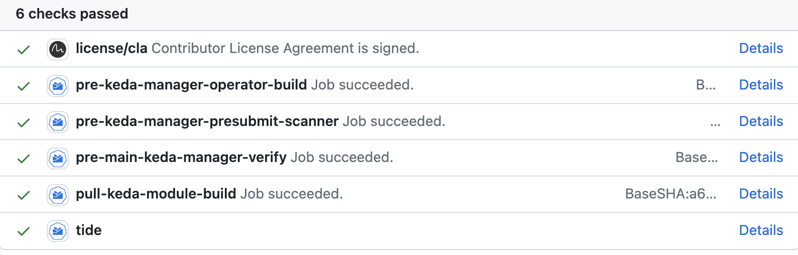

# How to install Keda Manager

## Installation on Kyma runtime

This section describes how to set up the Keda module (Keda + Keda Manager) on top of the Kyma installation with `lifecycle-manager`.
In such a setup, you don't need to install Keda Manager. It is installed and managed by `lifecycle-manager`.

### Lifecycle management of Keda Manager in Kyma

When you enable the Keda module using your Kyma runtime Kyma custom resource (CR), the `lifecycle-manager` downloads the bundled package of the Keda Manager and installs it. Additionally, it applies a sample Keda CR, which triggers Keda Manager to install the Keda module.


To enable the Keda module run:

   ```bash
   kyma alpha enable module keda -c fast
   ```

## Local k3d setup for the local lifecycle-manager & Keda Manager

> **TIP:** Use the dedicated `make` target (in the `hack` folder) to execute the following steps automatically.

1. Clone the project.

   ```bash
   git clone https://github.com/kyma-project/keda-manager.git && cd keda-manager/
   ```

2. Provide the k3d cluster.

   ```bash
   kyma provision k3d
   ```

3. Build and push the Keda Manager image.

   ```bash
   make module-image IMG_REGISTRY=localhost:5001/unsigned/manager-images IMG=localhost:5001/keda-manager-dev-local:0.0.2
   ```

4. Build and push the Keda module.

   ```bash
   make module-build IMG=k3d-kyma-registry:5001/keda-manager-dev-local:0.0.2 MODULE_REGISTRY=localhost:5001/unsigned
   ```

5. Verify if the module and the manager's image are pushed to the local registry.

   ```bash
   curl localhost:5001/v2/_catalog
   ```
   You should get a result similar to this example:

   ```json
   {"repositories":["keda-manager-dev-local","unsigned/component-descriptors/kyma-project.io/module/keda"]}
   ```
6. Inspect the generated module template.

   > **NOTE:** The following sub-steps are temporary workarounds.

Edit `template.yaml` and:
- change `target` to `control-plane`

   ```yaml
   spec:
    target: control-plane
    ```
> **NOTE:** This is required in the single-cluster mode only.

- change the existing repository context in `spec.descriptor.component`:

   ```yaml
   repositoryContexts:      
     - baseUrl: k3d-kyma-registry.localhost:5000/unsigned
       componentNameMapping: urlPath
       type: ociRegistry
   ```

7. Install the modular Kyma on the k3d cluster.

   > **NOTE** This installs the latest versions of `lifecycle-manager`.

   ```bash
   kyma alpha deploy
   ```
8. Deploy the Keda module manifest.

   ```bash
   kubectl apply -f https://github.com/kyma-project/keda-manager/releases/latest/download/moduletemplate.yaml
   ```

9.  Give Module Manager permission to install CustomResourceDefinition (CRD) cluster-wide.

   > **NOTE:** Module Manager must be able to apply CRDs to install modules. In the remote mode (with control-plane managing remote clusters) it gets an administrative kubeconfig, targeting the remote cluster to do so. But in the local mode (single-cluster mode), it uses Service Account and does not have permission to create CRDs by default.

   To make sure Module Manager's Service Account gets an administrative role, edit the cluster role:

   ```bash
   kubectl edit clusterrole module-manager-manager-role
   ```

Add the following element under `rules`:

   ```yaml
   - apiGroups:
     - "*"
     resources:
     - "*"                  
     verbs:                  
     - "*"
  ```

> **NOTE:** This is a temporary workaround and is only required in the single-cluster mode.

10. Enable Keda in the Kyma CR.

   ```bash
   kyma alpha enable module keda -c fast
   ```
   
### Local mode in k3d

When using a local k3d cluster, you can also use the local OCI image registry that comes with it.
Thanks to that, you don't need to push the Keda module images to a remote registry and you can test the changes in the Kyma installation set up entirely on your machine.

1. Clone the project.

   ```bash
   git clone https://github.com/kyma-project/keda-manager.git && cd keda-manager/
   ```
2. Build the manager locally and run it on the k3d cluster.

   ```bash
   make -C hack/local run-without-lifecycle-manager
   ```
3. If you want to clean up the k3d cluster, use the `make -C hack/local stop` make target.

### Install on remote Kyma runtime

Prerequisite: `lifecycle-manager` must be installed on the cluster (locally), or the cluster itself must be managed remotely by the central control-plane.

In this section, you will learn how to install a pull request (PR) version of the Keda module by a `lifecycle-manager` on a remote cluster.
You need OCI images for the Keda module version to be built and pushed into a public registry. You also need a module template matching the version, to apply it on the remote cluster.
CI jobs that are running on PRs and on main branch will help to achieve that.

1. Create a PR or use an existing one in the [`keda-manager`](https://github.com/kyma-project/keda-manager) repository; on the PR page, scroll down to the Prow jobs status list. 

   

2. After the job has finished with success, click **Details** next to the `pull-keda-module-build` job.

   

The module template will be printed in the module template section, between the tags.

> `~~~~~~~~~~~~BEGINING OF MODULE TEMPLATE~~~~~~~~~~~~~~`

	```yaml
	apiVersion: operator.kyma-project.io/v1alpha1
	kind: ModuleTemplate
	metadata:
	name: moduletemplate-keda
	...
	```

> `~~~~~~~~~~~~~~~END OF MODULE TEMPLATE~~~~~~~~~~~~~~~~`

<details>
<summary><b>Example of full job build result</b></summary>

	```text
	make: Entering directory '/home/prow/go/src/github.com/kyma-project/keda-manager/hack/ci'
	make[1]: Entering directory '/home/prow/go/src/github.com/kyma-project/keda-manager'
	mkdir -p /home/prow/go/src/github.com/kyma-project/keda-manager/bin
	## Detect if operating system 
	test -f /home/prow/go/src/github.com/kyma-project/keda-manager/bin/kyma-unstable || curl -s -Lo /home/prow/go/src/github.com/kyma-project/keda-manager/bin/kyma-unstable https://storage.googleapis.com/kyma-cli-unstable/kyma-linux
	chmod 0100 /home/prow/go/src/github.com/kyma-project/keda-manager/bin/kyma-unstable
	test -s /home/prow/go/src/github.com/kyma-project/keda-manager/bin/kustomize || { curl -s "https://raw.githubusercontent.com/kubernetes-sigs/kustomize/master/hack/install_kustomize.sh" | bash -s -- 4.5.6 /home/prow/go/src/github.com/kyma-project/keda-manager/bin; }
	{Version:kustomize/v4.5.6 GitCommit:29ca6935bde25565795e1b4e13ca211c4aa56417 BuildDate:2022-07-29T20:42:23Z GoOs:linux GoArch:amd64}
	kustomize installed to /home/prow/go/src/github.com/kyma-project/keda-manager/bin/kustomize
	cd config/manager && /home/prow/go/src/github.com/kyma-project/keda-manager/bin/kustomize edit set image controller=europe-docker.pkg.dev/kyma-project/dev/keda-manager:PR-101
	[0;33;1mWARNING: This command is experimental and might change in its final version. Use at your own risk.
	[0m- Kustomize ready
	- Module built
	- Default CR validation succeeded
	- Creating module archive at "./mod"
	- Image created
	- Pushing image to "europe-docker.pkg.dev/kyma-project/dev/unsigned"
	- Generating module template
	make[1]: Leaving directory '/home/prow/go/src/github.com/kyma-project/keda-manager'

	~~~~~~~~~~~~BEGINING OF MODULE TEMPLATE~~~~~~~~~~~~~~
	apiVersion: operator.kyma-project.io/v1alpha1
	kind: ModuleTemplate
	metadata:
	name: moduletemplate-keda
	namespace: kcp-system
	labels:
		"operator.kyma-project.io/managed-by": "lifecycle-manager"
		"operator.kyma-project.io/controller-name": "manifest"
		"operator.kyma-project.io/module-name": "keda"
	annotations:
		"operator.kyma-project.io/module-version": "0.0.2-PR-101"
		"operator.kyma-project.io/module-provider": "internal"
		"operator.kyma-project.io/descriptor-schema-version": "v2"
	spec:
	target: remote
	channel: fast
	data:
		apiVersion: operator.kyma-project.io/v1alpha1
		kind: Keda
		metadata:
			name: default
		spec:
			logging:
			operator:
				level: "debug"
			resources:
			operator:
				limits:
					cpu: "1"
					memory: "200Mi"
				requests:
					cpu: "0.5"
					memory: "150Mi"
			metricServer:
				limits:
					cpu: "1"
					memory: "1000Mi"
				requests:
					cpu: "300m"
					memory: "500Mi"
	descriptor:
		component:
			componentReferences: []
			name: kyma-project.io/module/keda
			provider: internal
			repositoryContexts:
			- baseUrl: europe-docker.pkg.dev/kyma-project/dev/unsigned
			componentNameMapping: urlPath
			type: ociRegistry
			resources:
			- access:
				digest: sha256:3bf7c3bc2d666165ae2ae6cbcad2e3fcaa3a66ca3afebda8c9d008ab93413453
				type: localOciBlob
			name: keda
			relation: local
			type: helm-chart
			version: 0.0.2-PR-101
			- access:
				digest: sha256:f4a599c4310b0fe9133b67b72d9b15ee96b52a1872132528c83978239b5effef
				type: localOciBlob
			name: config
			relation: local
			type: yaml
			version: 0.0.2-PR-101
			sources:
			- access:
				commit: f3b1b7ed6c175e89a7d29202b8a4cc4fc74cf998
				ref: refs/heads/main
				repoUrl: github.com/kyma-project/keda-manager
				type: github
			name: keda-manager
			type: git
			version: 0.0.2-PR-101
			version: 0.0.2-PR-101
		meta:
			schemaVersion: v2

	~~~~~~~~~~~~~~~END OF MODULE TEMPLATE~~~~~~~~~~~~~~~~
	make: Leaving directory '/home/prow/go/src/github.com/kyma-project/keda-manager/hack/ci'
	```
</details>

3. Save section's content in local file.

4. Apply the module template on your remote cluster:

   ```bash
   kubectl apply -f <saved_module_template_path>
   ```

5. Enable the Keda Manager module by patching the Kyma CRD.

   ```bash
   make -C hack/common module
   ```