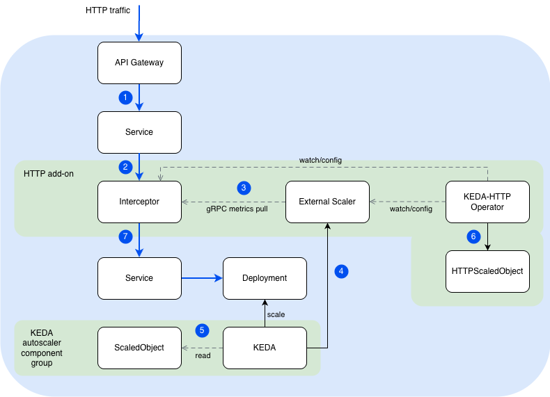

# KEDA HTTP Add-on

## Overview

The [KEDA HTTP Add-on](https://github.com/kedacore/http-add-on) extends KEDA with the ability to scale HTTP workloads to and from zero based on incoming request rate. It works by placing an **Interceptor proxy** in front of your application that counts, queues, and forwards HTTP requests — enabling true scale-to-zero without losing any requests.

## Architecture

The HTTP Add-on consists of three components:

| Component | Role |
|---|---|
| **Interceptor** | A reverse proxy that sits in front of your application. It counts incoming requests, queues them when the target has 0 replicas, and forwards them once the target is ready. |
| **Scaler** (External Scaler) | Exposes request-rate metrics to KEDA via gRPC so KEDA can make scaling decisions. |
| **Operator** | Watches `HTTPScaledObject` resources and configures the Interceptor routing and KEDA ScaledObjects. |

**Request flow:**



1. An `HTTP request` arrives at the **API Gateway**, which routes traffic to the **Interceptor's Service**.
2. The **Interceptor** receives the request, counts it, and queues it if the target workload has 0 replicas.
3. The **External Scaler** pulls request count metrics from the **Interceptor** via gRPC.
4. **KEDA** reads metrics from the **External Scaler** and scales the target **Deployment** accordingly (including to/from zero).
5. **KEDA** reconciles the **ScaledObject** (auto-created from HTTPScaledObject) to manage the scaling behavior.
6. The **KEDA-HTTP Operator** watches **HTTPScaledObject** resources and configures all add-on components (Interceptor routing, ScaledObject, External Scaler).
7. Once the **Deployment** has ready replicas, the **Interceptor** forwards the queued request to the application **Service**, which routes it to the running **Pod**.


## Enabling the HTTP Add-on

You enable the HTTP Add-on by annotating the Keda custom resource (CR):

```bash
kubectl annotate keda default \
  keda.kyma-project.io/addon-enabled=true \
  keda.kyma-project.io/addon-version=0.13.0 \
  keda.kyma-project.io/addon-namespace=keda
```

### Annotations Reference

| Annotation | Required | Description |
|---|---|---|
| `keda.kyma-project.io/addon-enabled` | Yes | Set to `true` to install, `false` to uninstall. |
| `keda.kyma-project.io/addon-version` | No | Semver version of the HTTP Add-on to install (for example, `0.13.0`). If omitted, the latest version is resolved automatically. |
| `keda.kyma-project.io/addon-namespace` | No | Namespace where the add-on is installed. Defaults to `kyma-system`. |

### Upgrading the HTTP Add-on Version

To upgrade (or downgrade) the HTTP Add-on to a different version, update the `addon-version` annotation:

```bash
kubectl annotate keda default \
  keda.kyma-project.io/addon-version=0.14.0 --overwrite
```

The controller automatically detects the version change, removes the old version's resources, and installs the new version in the same namespace. No manual cleanup is required.

### Changing the Installation Namespace

To move the HTTP Add-on to a different namespace, update the `addon-namespace` annotation:

```bash
kubectl annotate keda default \
  keda.kyma-project.io/addon-namespace=my-new-namespace --overwrite
```

The controller detects the namespace change, removes only the HTTP Add-on resources from the old namespace (other Deployments, Services, etc. in that namespace are not affected), creates the new namespace, if it doesn't exist, with `istio-injection=enabled`, and installs the HTTP Add-on in the new namespace.
1. Removes **only the HTTP Add-on resources** from the old namespace (other Deployments, Services, etc. in that namespace are not affected).
2. Creates the new namespace (if it doesn't exist) with `istio-injection=enabled`.
3. Installs the HTTP Add-on in the new namespace.

### Disabling the HTTP Add-on

```bash
kubectl annotate keda default \
  keda.kyma-project.io/addon-enabled=false --overwrite
```

This removes all add-on resources from the cluster (only the resources managed by the HTTP Add-on — other workloads in the namespace are not affected).

## Configuring the HTTP Add-on

The HTTP Add-on components are configured via environment variables on their Deployments. You can customize them by patching the respective Deployment after installation.

### Interceptor Timeouts

The most important configuration options are the Interceptor's timeout settings. These control how long the Interceptor waits during cold start and when forwarding requests to your application.

| Environment Variable | Default | Description |
|---|---|---|
| `KEDA_HTTP_REQUEST_TIMEOUT` | `0s` (unlimited) | Total wall-clock deadline from request arrival to response completion. When `0`, there is no total request deadline — the request can wait indefinitely for scale-up. |
| `KEDA_HTTP_READINESS_TIMEOUT` | `0s` (unlimited) | How long to wait for the backing workload to have ≥1 ready replicas before giving up. When `0`, the readiness wait is bounded only by the request timeout, giving the full request budget to cold starts. |
| `KEDA_HTTP_RESPONSE_HEADER_TIMEOUT` | `300s` | How long to wait for response headers from the backend after the request is forwarded. Acts as a safety net against hung backends. Set to `0` to disable. |
| `KEDA_HTTP_CONNECT_TIMEOUT` | `500ms` | Per-attempt TCP dial timeout when connecting to the backend. Bounded by the request context deadline. |

> **Note:** If `KEDA_HTTP_REQUEST_TIMEOUT` is set to `0` (default), the Interceptor will wait **indefinitely** for the target to scale up. This is the recommended setting when using the EnvoyFilter retry policy, as the retry policy on the Ingress Gateway side handles client-facing timeouts.

### Interceptor Connection Pool

These settings control the Interceptor's internal HTTP connection pool to backend services:

| Environment Variable | Default | Description |
|---|---|---|
| `KEDA_HTTP_MAX_IDLE_CONNS` | `1000` | Max idle connections across all backend services. Increase if you proxy to many unique backends. |
| `KEDA_HTTP_MAX_IDLE_CONNS_PER_HOST` | `200` | Max idle connections per backend service. Increase if you observe many new connection establishments under load. |
| `KEDA_HTTP_FORCE_HTTP2` | `false` | Force HTTP/2 for all upstream connections. |

### Interceptor Behavior

| Environment Variable | Default | Description |
|---|---|---|
| `KEDA_HTTP_ENABLE_COLD_START_HEADER` | `true` | When enabled, the Interceptor adds an `X-KEDA-HTTP-Cold-Start: true` response header if the request triggered a scale-from-zero. Useful for observability. |
| `KEDA_HTTP_LOG_REQUESTS` | `false` | Log every incoming request (for debugging). |

### Scaler Configuration

The External Scaler component has these key settings:

| Environment Variable | Default | Description |
|---|---|---|
| `KEDA_HTTP_QUEUE_TICK_DURATION` | `500ms` | How often the scaler fetches request counts from the Interceptor. Lower values give faster scaling reactions but increase gRPC traffic. |
| `KEDA_HTTP_SCALER_STREAM_INTERVAL_MS` | `200` | Interval (ms) between metric stream updates sent to KEDA. |


## Usage: HTTPScaledObject

After the add-on is installed, create an `HTTPScaledObject` to configure scaling for your workload:

```yaml
apiVersion: http.keda.sh/v1alpha1
kind: HTTPScaledObject
metadata:
  name: my-app
  namespace: my-namespace
spec:
  hosts:
  - "my-app.example.com"
  pathPrefixes:
  - /
  scaleTargetRef:
    name: my-app
    kind: Deployment
    apiVersion: apps/v1
    service: my-app
    port: 8080
  replicas:
    min: 0
    max: 10
  scalingMetric:
    requestRate:
      targetValue: 10
      granularity: "1s"
      window: "1m"
```

Key fields:
- **`replicas.min: 0`** — enables scale-to-zero.
- **`scalingMetric.requestRate.targetValue`** — number of requests per second per replica that triggers scale-out.
- **`scalingMetric.requestRate.window`** — time window over which request rate is averaged.

## Cold Start and the EnvoyFilter Requirement

### The Problem

When your application is scaled to zero and a request arrives, the following happens:

1. The Interceptor receives the request and queues it.
2. KEDA detects pending requests and scales the Deployment from 0 → 1.
3. The Pod starts (container pull, init containers, readiness probes, Istio sidecar injection).
4. **During this time, the Interceptor attempts to forward the request to the target Service.**

The Interceptor uses a **polling loop** that periodically checks if the target Deployment has ready endpoints. Once it detects `replicas > 0`, it forwards the queued request. However, there is a brief window where:
- The Interceptor sees a ready Pod and forwards the request.
- The Pod's readiness probe has passed, but the Istio sidecar or application is not yet fully ready to handle traffic.
- The upstream returns a `503` or the connection is refused.

Additionally, in some edge cases the Istio Ingress Gateway may get a `502`/`503` from the Interceptor itself if it's temporarily overloaded during the scale-up.

### The Solution: EnvoyFilter with Retry Policy

To handle the cold-start window without returning errors to the client, you **must** configure an EnvoyFilter on the Istio Ingress Gateway:

```yaml
apiVersion: networking.istio.io/v1alpha3
kind: EnvoyFilter
metadata:
  name: my-app-keda-retry
  namespace: istio-system
spec:
  workloadSelector:
    labels:
      istio: ingressgateway
  configPatches:
  - applyTo: HTTP_ROUTE
    match:
      context: GATEWAY
      routeConfiguration:
        vhost:
          name: "my-app.example.com:443"
          route:
            name: ""
    patch:
      operation: MERGE
      value:
        route:
          retry_policy:
            retry_on: "5xx,connect-failure,reset,refused-stream"
            num_retries: 100
            per_try_timeout: 3s
```

> **Important:** The `vhost.name` must match the actual virtual host name in Envoy's configuration. Use `istioctl proxy-config routes <ingressgateway-pod> -o json` to find the correct name. The format is typically `hostname:port` (for example, `my-app.example.com:443`), **not** `https://hostname`.

This retry policy ensures that during cold start:
- Failed attempts (502, 503, connection refused) are transparently retried.
- The client receives a successful response once the Pod is ready (up to 100 × 3s = 5 minutes of retries).

### Why Is This Necessary?

The HTTP Add-on Interceptor is designed to **queue requests** while the target is at 0 replicas, but once it detects at least 1 ready endpoint, it **immediately forwards** the request. It does **not** implement application-level retries. The Interceptor trusts the Kubernetes readiness signal, but in an Istio mesh:

1. A Pod can become "Ready" (readiness probe passes) while the Istio sidecar is still initializing.
2. The Service endpoints are updated, but the envoy proxy in the sidecar may not yet be configured.
3. The forwarded request hits a `503` or connection reset.

The EnvoyFilter retry policy at the Ingress Gateway level compensates for this gap.

## Limitations and Throughput Considerations

### 1. Interceptor Is a Proxy in the Data Path

Every request to your application goes through the Interceptor. This adds:
- **Latency:** Approximately 1–5ms per request in steady state (non-cold-start).
- **Resource overhead:** The Interceptor consumes CPU and memory proportional to the request rate.

### 2. Interceptor Queue Capacity

When the target is at 0 replicas, the Interceptor queues incoming requests **in memory**. Limits:
- There is **no configurable queue size limit** — all requests are queued until the Pod comes up or the request times out.
- **Memory pressure:** Under high burst traffic to a scaled-to-zero workload, the Interceptor may consume significant memory. If it OOMs, all queued requests are lost.
- **Request timeout:** The Interceptor has a default forwarding timeout (configurable via `KEDA_HTTP_DEFAULT_TIMEOUT`, default 3000ms for the connect phase). Requests exceeding this timeout after forwarding are dropped.

### 3. Scaling Latency (Cold Start Time)

The time from first request to successful response depends on:
- **KEDA polling interval:** Default 15 seconds (configured via `pollingInterval` on the ScaledObject). This is the delay before KEDA detects pending requests.
- **Pod startup time:** Container pull, init containers, readiness probes, Istio sidecar injection (typically 10–60 seconds).
- **Cooldown period:** After traffic stops, KEDA waits the `cooldownPeriod` (default 300 seconds) before scaling to zero.

**Total cold-start latency:** Typically 15–90 seconds depending on your Pod's startup time.

### 4. No Persistent Queue

Queued requests are stored in-memory. If the Interceptor Pod restarts or is evicted:
- All queued requests are **lost**.
- There is no at-least-once delivery guarantee.

### Summary Table

| Aspect | Value / Behavior |
|---|---|
| Added latency (steady state) | ~1–5ms |
| Cold-start latency | 15–90 seconds (depends on Pod startup) |
| Queue persistence | In-memory only (lost on restart) |
| Max queue size | Unlimited (bounded by memory) |
| KEDA polling interval | 15s default (configurable) |
| Cooldown before scale-to-zero | 300s default (configurable) |

## Related Links

- [KEDA HTTP Add-on GitHub](https://github.com/kedacore/http-add-on)
- [Scale-to-Zero Example](https://github.com/kyma-project/keda-manager/tree/main/examples/scale-to-zero-with-keda)