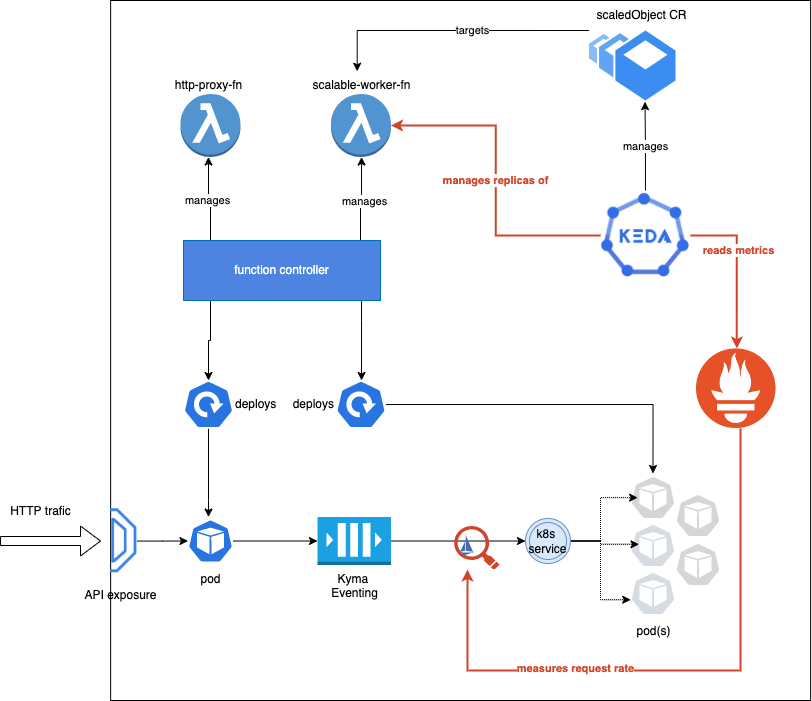

# Scale to Zero With Keda

## Overview
This example demonstrates an event-driven approach that allows you to decouple functional parts of an application and apply consumption-based scaling.
It uses: 
 - Functions to deploy workloads directly from a Git repository,
 - In-cluster Eventing to enable event-driven communication, 
 - [Keda](https://keda.sh/) to drive the Function's scaling,
 - Prometheus and Istio to deliver metrics essential for scaling decisions.

It realises the following scenario:



The proxy Function receives the incoming HTTP traffic, and with every request, it publishes the payload as an in-cluster event to a particular topic.

The second Function (the actual worker) is subscribed to the topic and processes the incoming messages. Until there are no messages published for its subscribed topic, it remains scaled to zero - there are no actual worker Pods living in the runtime.

KEDA is used to scale the worker Function. [KEDA Prometheus scaler](https://keda.sh/docs/latest/scalers/prometheus/) is used to measure the load targeted for the worker Function and scale it accordingly (from 0 to 5 replicas).


## Prerequisites

- Kyma as the target Kubernetes runtime.
- [Keda and Serverless modules installed](https://kyma-project.io/#/02-get-started/01-quick-install?id=steps)
- [Custom Prometheus stack installed](https://github.com/kyma-project/examples/blob/main/prometheus/README.md#installation) with [Istio scraping enabled](https://github.com/kyma-project/examples/blob/main/prometheus/README.md#installation)

## Installation

1. Make sure Istio sidecar injection is enabled in the target Namespace:

```bash
kubectl label namespace default istio-injection=enabled
```

2. Edit the `k8s-resources/scalable-worker-fn.yml` and `k8s-resources/peer-authentication.yaml` files to fill in the namespace value (namespace where Prometheus was deployed).

3. Apply the example resources from `./k8s-resources` directory:
```bash
kubectl apply -f ./k8s-resources
```

## Test the application

At first, the worker Function is scaled down.
1. List HPA for the Function and check that the current replica count is zero:
 ```bash
kubectl get hpa
NAME                               REFERENCE                     TARGETS             MINPODS   MAXPODS   REPLICAS   AGE
keda-hpa-worker-fn-scaled-object   Function/scalable-worker-fn   <unknown>/2 (avg)   1         5         0          27h

 ```
2. List Pods by Function name label and check that you see only the build job's Pod. No runtime Pod is up.
 ```bash
kubectl get pods -l serverless.kyma-project.io/function-name=scalable-worker-fn -w
NAME                                   READY   STATUS      RESTARTS   AGE
scalable-worker-fn-build-7s4rf-wjhvt   0/1     Completed   0          2m16s
 ```

3. Generate a load (even a single request) and check that the non-zero request rate targeting the worker Function triggers scaling up of the worker Function's runtime Pods.

 Call the HTTP proxy Function once:

 ```bash
 curl -H "Content-Type: application/json" -X POST -d '{"foo":"bar"}' https://incoming.{your_cluster_domain}
 ```

The message is pushed to Kyma Eventing.
It takes time to scale up a Function from zero. But no message is lost as Eventing retries delivery of the message to the subscriber until a running worker Pod eventually consumes it.

4. Observe worker Function scaling up from zero. You can notice it by watching Function Pods or HPA.
```bash
kubectl get pods -l serverless.kyma-project.io/function-name=scalable-worker-fn -w 
NAME                                   READY   STATUS      RESTARTS   AGE
scalable-worker-fn-build-k94qz-ntjmn   0/1     Completed   0          32s
scalable-worker-fn-2n269-6f6d5f675-t6nwr   0/2     Pending     0          0s
scalable-worker-fn-2n269-6f6d5f675-t6nwr   0/2     Pending     0          0s
scalable-worker-fn-2n269-6f6d5f675-t6nwr   0/2     Init:0/1    0          0s
scalable-worker-fn-2n269-6f6d5f675-t6nwr   0/2     Init:0/1    0          0s
scalable-worker-fn-2n269-6f6d5f675-t6nwr   0/2     Init:0/1    0          1s
scalable-worker-fn-2n269-6f6d5f675-t6nwr   0/2     PodInitializing   0          2s
scalable-worker-fn-2n269-6f6d5f675-t6nwr   0/2     Running           0          7s
```
```bash
kubectl get hpa -w                                                        
NAME                               REFERENCE                     TARGETS             MINPODS   MAXPODS   REPLICAS   AGE
keda-hpa-worker-fn-scaled-object   Function/scalable-worker-fn   <unknown>/2 (avg)   1         5         0          27h
keda-hpa-worker-fn-scaled-object   Function/scalable-worker-fn   0/2 (avg)           1         5         1          27h
```

Observe that the payload was eventually processed.

5. Check the worker Function logs. `Processing ... {"foo":"bar"}` eventually appears:

 ```bash
kubectl logs -l serverless.kyma-project.io/function-name=scalable-worker-fn -f
> nodejs16-runtime@0.1.0 start
> node server.js

user code loaded in 0sec 0.783514ms
Processing ...
{"foo":"bar"}

 ```
 
 If the traffic stops, the worker Function is scaled down back to zero replicas (after a configurable cooldown period).
 
6. If you generate a much higher load, for example,> 2 req/sec - as configured in the threshold value of the scaledObject, you will observe scaling up to more replicas. One replica must be added for each additional 2req/sec measured. 
