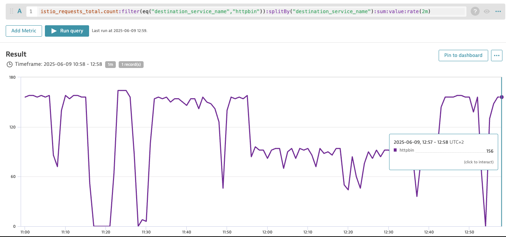

# Dynatrace Request Rate Scaler Example

This example helps you set up the infrastructure needed for request rate-based autoscaling using Dynatrace and the Keda and Istio modules in the Kyma environment.

## Prerequisites

- Kyma runtime with the Keda, Istio, and API Gateway modules added
- Dynatrace instance available

## Contents

`/k8s-resources/application.yaml` defines the following elements:
 - The `keda-dynatrace` namespace to isolate the example resources.
 - The `httpbin` sample application with the Istio sidecar injected. The sidecar exposes Prometheus-compatible metrics on port 15090.
 - The `httpbin` service that exposes the application on port 80.
 - The `httpbin-metrics` service that exposes the Istio sidecar metrics on port 15090. The service includes Dynatrace annotations to enable metric scraping from the Istio sidecar.
 - The `httpbin` APIRule to expose the `httpbin` service externally using the Kyma API Gateway.

`/k8s-resources/scaler.yaml` defines the following elements:
 - Secret with the `host` and `token` keys (token must have `metrics.read` permission).
 - `TriggerAuthentication` that references the Secret.
 - `ScaledObject` that defines target workload, references `TriggerAuthentication` object, and configures the [Dynatrace trigger](https://keda.sh/docs/latest/scalers/dynatrace/).

## How It Works

   The Istio sidecar in the `httpbin` Deployment exposes metrics on port 15090 at the `/stats/prometheus` endpoint.  
   The dedicated `httpbin-metrics` Service exposes metrics port 15090 and is annotated so that Dynatrace can discover and scrape these metrics.

   Dynatrace scrapes the Istio metrics, including total request count, from the annotated Service.

   Keda `ScaledObject` with a `dynatrace` trigger autoscales the `httpbin` deployment based on incoming request rate.

## Procedure

1. Apply the manifests in this folder to your Kubernetes cluster:

```bash
   kubectl apply -f ./k8s-resource
```

2. Generate HTTP traffic of 2 requests per second by running:

```bash
   export CLUSTER_DOMAIN="<your cluster domain>"
   while true; do sleep 0.5; wget -q -O- "https://httpbin.${CLUSTER_DOMAIN}/get" ; done
```

3. Observe the metric value in the Dynatrace UI:



The measured value divided by the threshold value should give the number of desired replicas.
`150 / 50 = 3`.

4. Observe how the `httpbin` Pods get autoscaled to 3 replicas:

```bash
kubectl get pods -n keda-dynatrace -w
NAME                       READY   STATUS    RESTARTS   AGE
httpbin-5fb66474c4-4v2xj   2/2     Running   0          65s
httpbin-5fb66474c4-llggp   2/2     Running   0          48m
httpbin-5fb66474c4-zdqg2   2/2     Running   0          64s
```
