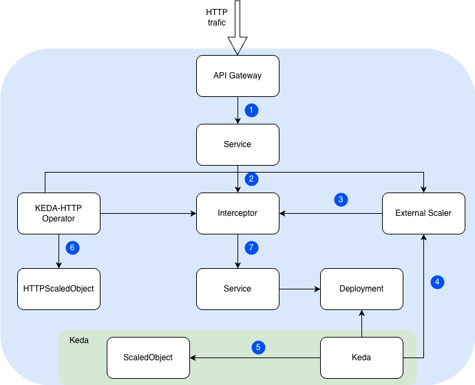

# Scale to Zero with KEDA HTTP Add-on

## Overview

This example demonstrates how to use the [KEDA HTTP Add-on](https://github.com/kedacore/http-add-on) on a Kyma cluster to achieve HTTP-based scale-to-zero and scale-from-zero for workloads, without losing any requests.
It uses:

- [KEDA HTTP Add-on](https://github.com/kedacore/http-add-on) to intercept, queue, and count incoming HTTP requests — enabling scale-to-zero and scale-from-zero without lost requests,
- [KEDA](https://keda.sh/) to drive the workload's scaling based on request rate metrics provided by the HTTP Add-on,
- A demo application ([hashicorp/http-echo](https://hub.docker.com/r/hashicorp/http-echo)) that returns request-specific information (request headers, pod name, timestamp) to verify that no requests are lost during scaling,
- Istio service mesh to provide mTLS encryption between all components and to expose the application via API Gateway,
- API Gateway (APIRule v2) to route external HTTPS traffic to the HTTP Add-on's Interceptor.

It realises the following scenario:



1. `http request` arrives at the **API Gateway**, which routes traffic to the **Interceptor's Service**.
2. The **Interceptor** receives the request, counts it, and queues it if the target workload has 0 replicas.
3. The **External Scaler** pulls request count metrics from the **Interceptor** via gRPC.
4. **KEDA** reads metrics from the **External Scaler** and scales the target **Deployment** accordingly (including to/from zero).
5. **KEDA** reconciles the **ScaledObject** (auto-created from HTTPScaledObject) to manage the scaling behavior.
6. The **KEDA-HTTP Operator** watches **HTTPScaledObject** resources and configures all add-on components (Interceptor routing, ScaledObject, External Scaler).
7. Once the **Deployment** has ready replicas, the **Interceptor** forwards the queued request to the application **Service**, which routes it to the running **Pod**.


## Prerequisites

- Kyma as the target Kubernetes runtime.
- [Keda, Istio and API Gateway modules installed](https://kyma-project.io/02-get-started/01-quick-install.html#steps)


## Installation

1. Install the `http-add-on`

Create a dedicated namespace and install the add-on via Helm:

Add Helm repository
```bash
helm repo add kedacore https://kedacore.github.io/charts
helm repo update
```

Create namespace with Istio sidecar injection enabled
```bash
kubectl create namespace http-add-on
kubectl label namespace http-add-on istio-injection=enabled
```
Install the http-add-on
```bash
helm install http-add-on kedacore/keda-add-ons-http \
  --namespace http-add-on
  ```

  2. Configure Istio compatibility

  The add-on components use gRPC on port 9090 for internal communication. Istio sidecar intercepts this traffic and breaks gRPC health checks, causing `CrashLoopBackOff`. Exclude port 9090 from sidecar interception on all add-on deployments:
  - keda-add-ons-http-controller-manager
  - keda-add-ons-http-external-scaler
  - keda-add-ons-http-interceptor

  ```bash
  kubectl patch deployment <http-add-on-deployment> -n http-add-on \
  --type=merge \
  -p '{"spec":{"template":{"metadata":{"annotations":{"traffic.sidecar.istio.io/excludeInboundPorts":"9090"}}}}}'
  ```

  3. Edit the `k8s-resources/apirule.yaml` and `k8s-resources/httpscaledobject.yaml` files to fill in the hosts value.

  4. Apply the example resources from `./k8s-resources` directory:

```bash
kubectl apply -f ./k8s-resources
```

tutaj opisać jeszcze co robi dany resource, poprawić apkę
dodać info na temat tune cold start

## Test the application 

At first, the application Pod is scaled down.

1. List HPA for the demo application and check that the current replica count is zero:

```bash
kubectl get hpa -n demo-app
NAME            REFERENCE         TARGETS              MINPODS   MAXPODS   REPLICAS   AGE
keda-hpa-xkcd   Deployment/xkcd   <unknown>/10 (avg)   1         10        0          2h
```

2. List Pods of demo application and check that replica count is zero:

```bash
kubectl get pod -n  demo-app
No resources found in demo-app namespace.
```

3. Generate a load (even a single request) and check that the non-zero request rate
