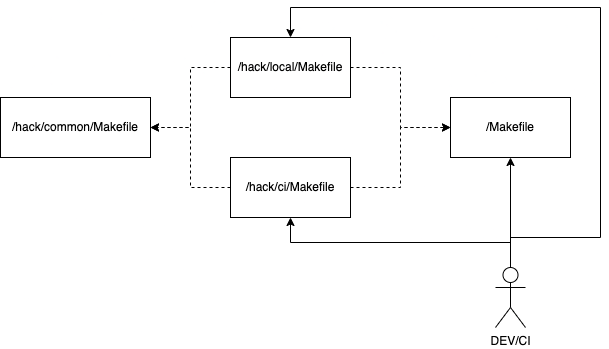

# Makefile architecture

The main goal is to develop a way to extend Makefile targets in the most readable way, without keeping all targets in one file. The second goal is not to break the common Makefile use case, where all basic targets are stored in the main Makefile on the project root.

Pros of the architecture:

* targets are well organized
* single responsibility
* extensibility
* works as a wrapper (does not break common Makefile use)
* high configuration separation (between hack/ci and hack/local)
* segregation principle interface
* no dependencies between Makefiles under the hack dir (hack/ci and hack/local).
* dependency inversion

## Dependencies Graph



## Dependencies description

* `Makefile` - Independent makefile contains all basic operations like builds, tests, etc. It should be readable for every person that doesn't know this article.
* `hack/ci/Makefile` - High-level API that contains all targets that may be used by any CI/CD system. It has dependencies on the `Makefile` and the `hack/common/Makefile`.
* `hack/local/Makefile` - High-level API that contains all targets that may be used by any developer. It has dependencies on the `Makefile` and the `hack/common/Makefile`.
* `hack/common/Makefile` - Contains all common targets that may be used by the `hack/ci/Makefile` or/and the `hack/local/Makefile`. It should not contain basic targets (other than `Makefile`) but other repo-oriented and helpers' targets.

## Good practices

Every `Makefile` must contain a few pieces, making the file more useful and human-readable:

* `help` - this target helps with describing what is inside Makefile and what we can do with it.
* Description - helps understand what the target does and shows it in the help. (`## description` after target name).
* Sections - allow for separations of targets based on their destination. (`##@`).

Example of target that includes all good practices:

```Makefile
##@ General

.PHONY: help
help: ## Display this help.
    @awk 'BEGIN {FS = ":.*##"; printf "\nUsage:\n  make \033[36m<target>\033[0m\n"} /^[a-zA-Z_0-9-]+:.*?##/ { printf "  \033[36m%-15s\033[0m %s\n", $$1, $$2 } /^##@/ { printf "\n\033[1m%s\033[0m\n", substr($$0, 5) } ' $(MAKEFILE_LIST)
```
